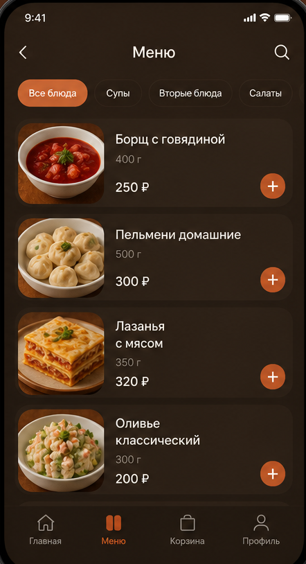
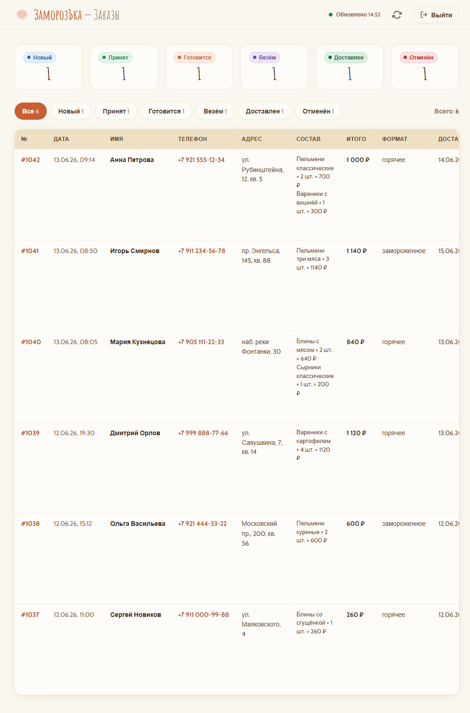
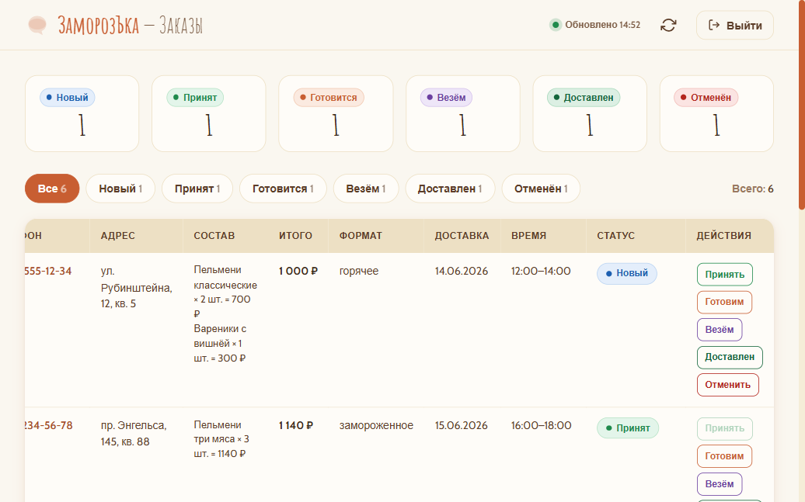

# ЗаморозЪка — сайт доставки домашних полуфабрикатов

Коммерческий лендинг для малого бизнеса: доставка домашних пельменей и блинов ручной лепки по Санкт-Петербургу. Сайт закрывает полный цикл — от витрины до приёма и обработки заказа — без CMS и без дополнительных SaaS-платформ.

## 🌐 Живой сайт

https://plemennaya-spb.ru

## 📱 Telegram Mini App

Бот: [@zamorozka_spb_bot](https://t.me/zamorozka_spb_bot) → кнопка **«🛒 Магазин»**

## ✅ Что реализовано

- 🖥 Лендинг из 10 блоков: Hero с видеофоном, каталог с табами, зона доставки с картой Leaflet, отзывы, контакты
- 🛒 Корзина на `localStorage` — добавление, счётчик, сайдбар, переход к оформлению
- 📋 Форма заказа с валидацией → вебхук n8n → запись в PostgreSQL
- 🤖 Telegram-бот: уведомления о новых заказах, управление статусами прямо из чата
- 🔐 Админ-панель (`admin.html`): фильтрация по статусам, смена статуса, авто-обновление каждые 30 с
- 💬 AI-чат-виджет (OpenAI gpt-4o-mini через n8n) — консультирует по меню, помнит контекст диалога
- 📱 Telegram Mini App: MainButton «Оформить заказ», определение контекста, передача данных пользователя в заказ
- 🚀 Деплой: Docker + Traefik + Let's Encrypt HTTPS, VPS Beget

## 🛠 Технологии

| Слой | Стек |
|------|------|
| Frontend | HTML5, Tailwind CSS, Vanilla JS (ES2020+) |
| Карта | Leaflet.js |
| Автоматизация | n8n (self-hosted) |
| AI | OpenAI gpt-4o-mini |
| БД | PostgreSQL |
| API | PHP (`api.php`) |
| Telegram | Bot API + Mini App SDK |
| Инфраструктура | Docker, Traefik, VPS Beget |

## 🏗 Архитектура

```
Браузер / Telegram Mini App
        │
        ▼
   n8n webhook
   ┌────────────────────────────┐
   │  Валидация → запись в БД   │
   │  PostgreSQL                │
   │  Уведомление в Telegram    │
   └────────────────────────────┘
        │
        ▼
  Telegram-бот (статусы заказов)
        │
        ▼
  Админ-панель (api.php → PostgreSQL)
```

## 📸 Скриншоты





## 👤 Об авторе

Александр — junior AI-разработчик, Санкт-Петербург.  
Специализация: n8n-автоматизации, Telegram-боты, AI-интеграции, лендинги под ключ.
